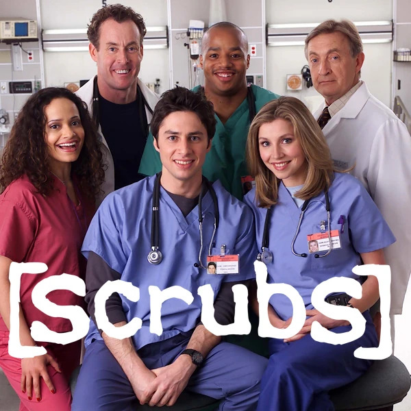
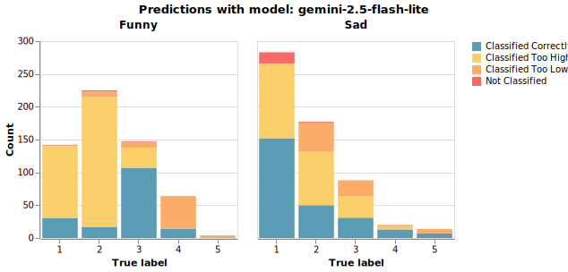
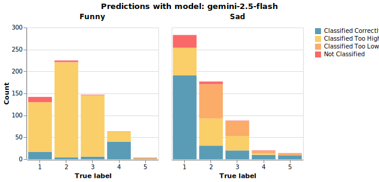
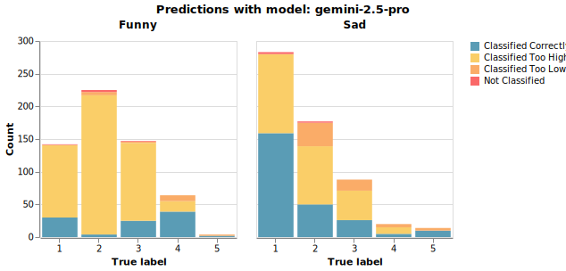
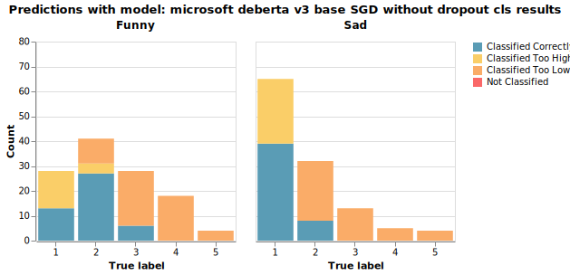

# Final Project Report - Evan Fantozzi

## Can a model learn how I (and others) feel about the TV show Scrubs?



Growing up, I was a huge fan of the show [Scrubs](https://en.wikipedia.org/wiki/Scrubs_(TV_series)). It felt very goofy and safe, but at the same time would drop these sudden emotional moment that really hit hard. I've looked around, and other fans seem to agree (see [here](https://www.reddit.com/r/Scrubs/comments/1ifrxf3/why_scrubs_hits_so_hard_its_literally_a/), [here](https://www.newsbytesapp.com/news/entertainment/what-scrubs-gets-right-about-medical-humor/story), and [here](https://cynthiaailshie.wordpress.com/2018/05/21/great-stories-scrubs/), for example). In fact, the show was even [rebooted](https://www.imdb.com/title/tt40197357/) recently, which inspired me to try out this project. 

I had two goals as part of this project. First, I wanted to see if I could get a machine learning model to accurately predict how funny and sad a given scene in Scrubs is. Second, I wanted to see if, using the predictions from a model, I could use those scene-level rating predictions to explain and predict how people felt about an episode of Scrubs on [IMDb](https://www.imdb.com/title/tt0285403/). Specifically, I was interested in exploring my belief about the importance of those emotional gut-punches, and how they work together with the show's comedic scenes to keep us hooked.

This project repository represents the machine learning pipeline from start to finish. I scraped detailed episode transcripts from [the Scrubs Fandom Wiki](https://scrubs.fandom.com/wiki/Scrubs_Wiki:Transcripts) and episode ratings from [IMDb (via the third-party ScrapingBee)](https://www.scrapingbee.com/blog/how-to-scrape-imdb/). I then had an LLM build me a quick labeling tool that I used to label 15 episodes. For each episode, I rated how funny and sad/emotional each scene was on a 1-5 scale while rewatching the episodes. From there, I exported the labels and merged them with the episode transcripts to fine-tune several variations of a DeBERTa-based classifier using Google Colab. Additionally, I tested Gemini 2.5 Pro, Flash, and Flash-Lite on the labeled scenes using few-shot prompting. I evaluated the performance of both approaches, and selected the highest-performing model from each to perform inference on all of the scraped transcripts. From there, I took those funny/sad scene predictions, aggregated them at the episode level, and used them to predict IMDb ratings for the episodes. 

The steps below describe this pipeline in more detail

## 1. Scraping

### A. Transcripts

To get transcripts for Scrubs, I initially downloaded (and even labeled) subtitle (.SRT) files from [TVSubtitles.net](https://www.tvsubtitles.net/tvshow-26-1.html), but was pretty unsatisfied with the lack of visual detail in the subtitles. After researching a bit more, I stumbled upon fan-made transcripts available on the Scrubs Fandom page. It's worth mentioning that, due to this fan-made nature, there is some stylistic variation from episode to episode. Additionally, the transcripts end partway through season 6 (out of 8 - I choose to not acknowledge season 9). That said, even with these limitations, the Fandom transcripts include speaker labels and much more rich descriptions than the subtitle files. I felt that this level of detail would be beneficial for the fine-tuning step of my project. 

For example, here's a comparison for the beginning of Season 1, Episode: 5:

- Subtitles:
  > How's he doing?  
  > He has neutropenic fever.    
  > His white blood cell count's stabilised.     
  > He's not getting any worse.       
  > How you feeling, Jared?         
  > OK, I guess.         

vs. 

- Fandom Transcription:
  > Open: The Hospital -- The ICU -- A Patient's Room (daytime) Elliot stands at the end of a young boy's bed, reading his chart.  
  > The boy, Jared, has his eyes locked on his TV. J.D. enters.  
  > J.D.: [quietly, to Elliot] Hey, how's he doing?  
  > Elliot: Well, he was admitted with neutropenic fever, but his white blood cell count's stabilized. Best I can say is he's not getting any worse.  
  > They turn around to face the boy.  
  > Elliot: [chipper] How ya feeling, Jared?  
  > Jared: Okay, I guess.

Fandom has a generous API that made scraping the transcripts relatively straightforward. The scraper starts by finding all the season "subcategories" within the transcripts "category" for the show, and iterating through each season to scrape individual episode transcript pages. For each episode, it extracts the raw HTML from the corresponding page and removes irrelevant information such as navigation links, repeat lines, and ads, keeping only the actual lines of dialogue and descriptions. It then groups these lines into scenes of up to 150 words each. It generates a scene ID for each scene, and also assigns a position value between 0 and 1 measuring how far along in the episode the scene falls. 

The decision to split scenes on word counts was mostly based on trial and error. I tried a couple other heuristics such as splitting scenes based on the main character's internal monologue, but that was inconsistent and sometimes scenes based on these heuristics would run on for too long. On the flip side, splitting an episode into too many scenes would also be problematic, since labeling more than ~50 scenes per episode would limit how many episodes I could cover.

### B. IMDb Ratings

As part of the project I wanted to obtain IMDb ratings for each episode so I could explore the relationship between my predicted funny/sad ratings and the IMDb ratings. Unfortunately, IMDb requires creating an AWS account to access [its API](https://developer.imdb.com/), which felt out of scope for the task at hand. Instead, I found [this ScrapingBee article](https://www.scrapingbee.com/blog/how-to-scrape-imdb/) and used their free trial. To determine which pages to scrape, I manually compiled a list of episode URLs. The IMDb scraping script iterates over the episodes in this list, and extracts and saves the distribution of user ratings for each episode. 

### C. Inputs and outputs

#### Inputs

The Fandom scraper has no inputs. The IMDb scraper takes in the list of episode URLs stored in `scrapers/imdb/imdb_episode_urls.txt`.

#### Outputs

The directory of transcript JSON files is saved to `data/transcripts/`, split by season. The IMDb ratings are similarly saved to `data/imdb_episode_ratings.json`.

## 2. Labeling

### A. Labeling App

Given the scope of this project, I wanted to speed up my labeling process. I had Cursor generate a small labeling app using Flask and DuckDB so I could keep track of funny and sad ratings for each labeled episode. The app included a function to return a JSON file with the list of labels. 

### B. Labels

I labeled funny and sad ratings for scenes in 15 episodes. I picked a range of episodes based on their tone, and specifically tried to include some of the more famous, gut-wrenching episodes (such as Season 3, Episode 14 where a recurring character suddenly dies) and some of the lighter, sillier episodes (like Season 4, Episode 7 where the main character's brother spends a lot of time drinking beer in the bathtub). While labeling scenes, I often followed along by watching the episode in real time. I do confess, however, that I remembered some episodes well enough to label scenes without needing to rewatch.

### C. Exporting Labels 
The `labeling_app/export_labeled_scenes.py` script (written by me) merges the funny and sad labels with the text from the scene. It also adds the text from the previous scene and an episode ID based on the scene ID.

### D. Inputs and Outputs

#### Inputs

The labeling app uses the scraped scenes in `data/transcripts/`.

#### Outputs

The script exporting labeled scenes saves a JSON file to `data/labeled_scenes.json` with the labels, current/previous scene texts, episode/scene IDs, and scene position in the episode.

## 3. Fine-Tuning DeBERTa and Prompting Gemini

As discussed above, I sought to try two different approaches with this project, predicting funny/sad ratings with a fine-tuned, locally run model and then predicting those same ratings by prompting a large language model. 

### A. DeBERTa

Based on our experience in our course, I wanted to use a BERT-based model since I could add a classification head (or two) to the pre-trained model. Based on what I read [online](https://huggingface.co/docs/transformers/en/model_doc/deberta), DeBERTa was particularly effective for encoding text for classification tasks with relatively few training data, as was my case.

The `DeBERTa/fine_tune.ipynb` notebook, which I ran on Google Colab, adds two classification heads to the pre-trained model, one each for funny and sad ratings. For each scene, I encode the text from that scene and the previous scene, and then concatenate both, along with the difference between the two. I also concatenate the scene position scalar. As such, my fine-tuned model ends up with $d_{model} = 3d_{emb_{DeBERTa}} + 1$

I tried a combination of model parameters:
- Using DeBERTa-v3-small vs. DeBERTa-v3-base (larger), 
- Adam optimizer with decay vs. stochastic gradient descent
- Applying dropout vs. not
- Use the returned [classifier token](https://huggingface.co/docs/transformers/en/model_doc/deberta#transformers.DebertaTokenizer.cls_token) to interpret DeBERTa encodings vs. taking the mean across the sequence of returned tokens 

Using the validation set, I ran 25 epochs on each combination of the parameters above and kept [the checkpoint with the best validation accuracy for each combination of parameters](https://drive.google.com/drive/folders/1ZkqOAU62peGowTjACZBt2p8RNh_Mu4c_?usp=sharing). I then used these checkpoints for inference, and saved the resulting predictions for the model evaluation step. 

### B. Gemini

Using the same labeled scenes we used to fine-tune DeBERTa, the `gemini/predict_labeled_scenes.py` script uses two-shot learning to make predictions, based on the following prompt:

```
You are scoring scenes from the TV show Scrubs on how funny and sad they are on a 1 (least) to 5 (most) scale.

Example 1 — Scene: Jordan: It's Jack's first birthday. I want it to be special. I got a petting zoo for the kids. Cox: How about a Russian Roulette booth? We put bullets in ALL the chambers. That way everyone wins! J.D.: Will there be a piñata? Because I need to know if I should bring my piñata helmet. Jordan: Would you zip it, nerd? The only reason I invited you is because you have your own Spongebob Squarepants costume.
Funny: 4
Sad: 1

Example 2 — Scene: Dr. Cox: Time's up. Carla, would you do it for him, please? J.D.: Why are you telling her? Dr. Cox: Shut up and watch. Dr. Cox: Why does this GOMER got to try and die everyday during my lunch? J.D.: That's a little insensitive. J.D.'s narration: Mistake.
Funny: 2
Sad: 2

Now rate this scene.
Location in episode (0 = beginning, 1 = end): LOCATION
Previous scene: PREVIOUS SCENE TEXT
Scene: SCENE TEXT

Respond in exactly this format:
Funny: <number>
Sad: <number>
```

The script prompts three different models, Gemini 2.5 Pro, Gemini 2.5 Flash, and Gemini 2.5 Flash-Lite, saving the resulting predictions. 

### C. Inputs and Outputs

#### Inputs

The fine-tuning notebook and prompting script use the labeled scenes in `data/labeled_scenes.json`.

#### Outputs

The notebook saves the model checkpoints to DeBERTa/models, which I uploaded [here](https://drive.google.com/drive/folders/1ZkqOAU62peGowTjACZBt2p8RNh_Mu4c_?usp=sharing) and the prediction JSON files to `data/DeBERTa_predictions/labeled_scenes/`. The prompting script saves the prediction JSON files to `data/gemini_predictions/labeled_scenes/`.

## 4. Model Evaluations

### A. Description

The `evaluate_models/evaluate.py` script iterates over all DeBERTa and Gemini predictions for the labeled scenes, and computes accuracy, precision, recall, and F1 for each class for funny and sad predictions. These metrics are averaged across the classes to create model-specification-level metrics, as shown below:
| Model Specification | Type of Prediction | Accuracy | Precision | Recall | F1 |
|-------|-------------|----------|-----------|--------|----|
| microsoft_deberta_v3_base_AdamW_with_dropout_cls_results | funny | 0.3361 | 0.1468 | 0.2042 | 0.1433 |
| microsoft_deberta_v3_base_AdamW_with_dropout_cls_results | sad | 0.479 | 0.1403 | 0.1849 | 0.1541 |
| microsoft_deberta_v3_base_AdamW_with_dropout_mean_pooling_results | funny | 0.3025 | 0.1404 | 0.1892 | 0.1476 |
| microsoft_deberta_v3_base_AdamW_with_dropout_mean_pooling_results | sad | 0.437 | 0.1539 | 0.1886 | 0.1694 |
| microsoft_deberta_v3_base_AdamW_without_dropout_cls_results | funny | 0.3361 | 0.1272 | 0.211 | 0.1526 |
| microsoft_deberta_v3_base_AdamW_without_dropout_cls_results | sad | 0.437 | 0.1589 | 0.1949 | 0.175 |
| microsoft_deberta_v3_base_AdamW_without_dropout_mean_pooling_results | funny | 0.3361 | 0.2684 | 0.1974 | 0.1144 |
| microsoft_deberta_v3_base_AdamW_without_dropout_mean_pooling_results | sad | 0.563 | 0.3111 | 0.2125 | 0.1664 |
| microsoft_deberta_v3_base_SGD_with_dropout_cls_results | funny | 0.3277 | 0.2966 | 0.2418 | 0.2266 |
| microsoft_deberta_v3_base_SGD_with_dropout_cls_results | sad | 0.5126 | 0.1866 | 0.2194 | 0.1981 |
| microsoft_deberta_v3_base_SGD_with_dropout_mean_pooling_results | funny | 0.3445 | 0.1702 | 0.2023 | 0.1166 |
| microsoft_deberta_v3_base_SGD_with_dropout_mean_pooling_results | sad | 0.5294 | 0.1578 | 0.197 | 0.1489 |
| microsoft_deberta_v3_base_SGD_without_dropout_cls_results | funny | 0.3866 | 0.2347 | 0.2674 | 0.2359 |
| microsoft_deberta_v3_base_SGD_without_dropout_cls_results | sad | 0.395 | 0.1432 | 0.17 | 0.1551 |
| microsoft_deberta_v3_base_SGD_without_dropout_mean_pooling_results | funny | 0.3697 | 0.2721 | 0.2237 | 0.1553 |
| microsoft_deberta_v3_base_SGD_without_dropout_mean_pooling_results | sad | 0.479 | 0.1666 | 0.2039 | 0.1826 |
| microsoft_deberta_v3_small_AdamW_with_dropout_cls_results | funny | 0.2857 | 0.16 | 0.1885 | 0.1627 |
| microsoft_deberta_v3_small_AdamW_with_dropout_cls_results | sad | 0.5546 | 0.2593 | 0.2376 | 0.2237 |
| microsoft_deberta_v3_small_AdamW_with_dropout_mean_pooling_results | funny | 0.3277 | 0.2147 | 0.2152 | 0.1899 |
| microsoft_deberta_v3_small_AdamW_with_dropout_mean_pooling_results | sad | 0.5042 | 0.1165 | 0.1846 | 0.1429 |
| microsoft_deberta_v3_small_AdamW_without_dropout_cls_results | funny | 0.3529 | 0.2147 | 0.2456 | 0.2235 |
| microsoft_deberta_v3_small_AdamW_without_dropout_cls_results | sad | 0.4958 | 0.2178 | 0.2161 | 0.2043 |
| microsoft_deberta_v3_small_AdamW_without_dropout_mean_pooling_results | funny | 0.3193 | 0.1647 | 0.1967 | 0.1449 |
| microsoft_deberta_v3_small_AdamW_without_dropout_mean_pooling_results | sad | 0.5546 | 0.2111 | 0.2062 | 0.1546 |
| microsoft_deberta_v3_small_SGD_with_dropout_cls_results | funny | 0.2857 | 0.1467 | 0.1862 | 0.1598 |
| microsoft_deberta_v3_small_SGD_with_dropout_cls_results | sad | 0.5546 | 0.2068 | 0.2253 | 0.1992 |
| microsoft_deberta_v3_small_SGD_with_dropout_mean_pooling_results | funny | 0.3193 | 0.1007 | 0.1899 | 0.1195 |
| microsoft_deberta_v3_small_SGD_with_dropout_mean_pooling_results | sad | 0.5462 | 0.1092 | 0.2 | 0.1413 |
| microsoft_deberta_v3_small_SGD_without_dropout_cls_results | funny | 0.2857 | 0.1471 | 0.1885 | 0.1599 |
| microsoft_deberta_v3_small_SGD_without_dropout_cls_results | sad | 0.395 | 0.1395 | 0.1637 | 0.1506 |
| microsoft_deberta_v3_small_SGD_without_dropout_mean_pooling_results | funny | 0.3613 | 0.2458 | 0.2188 | 0.1544 |
| microsoft_deberta_v3_small_SGD_without_dropout_mean_pooling_results | sad | 0.5546 | 0.1714 | 0.2094 | 0.1651 |
| gemini-2.5-flash-lite | funny | 0.2887 | 0.3006 | 0.2467 | 0.206 |
| gemini-2.5-flash-lite | sad | 0.4347 | 0.419 | 0.4644 | 0.404 |
| gemini-2.5-flash | funny | 0.1168 | 0.2769 | 0.2107 | 0.1022 |
| gemini-2.5-flash | sad | 0.4485 | 0.3771 | 0.444 | 0.3823 |
| gemini-2.5-pro | funny | 0.1718 | 0.2623 | 0.3017 | 0.1628 |
| gemini-2.5-pro | sad | 0.4296 | 0.3596 | 0.4208 | 0.3602 | 

### B. Gemini Models Analysis

Among the Gemini models, Flash-Lite appears to have performed the best. It had the best sad metrics (precision of 0.42, recall of 0.46, and F1 of 0.40) and the best funny precision (0.30) and F1 (0.21) of the three. Flash and Pro had higher recall on funny for some classes but much lower accuracy because they overfitted and defaulted to predicting the same labels repeatedly. Overall, Flash-Lite’s balance made it the best choice for scene-level predictions.





### C. DeBERTa Models Analysis

Among the DeBERTa models, the base model trained with SGD without dropout, using the CLS token for encodings, performed best. It had the highest funny accuracy (0.39) and f1 (0.24), and while its sad accuracy (0.40) was not the highest, it was more balanced across rating classes than the other models. In contrast, many of the AdamW and mean pooling models ended up predicting the same class repeatedly, especially for funny predictions. Models with SGD but without dropout were more spread out across the 1-3 ratings classes. It seems that the CLS token approach performed well due to the size of scenes, and the noise introduced from averaging 100+ tokens.



It's also worth noting that the DeBERTa models as a whole did poorly on funny and sad labels of 4 and 5 (that is, those that are more funny or more sad), largely because the labeled data had relatively few scenes at those extremes. For example in Season 3, Episode 5, the hospital lawyer Ted loses a competition against the chief of medicine's dog Baxter to see who is smarter. The DeBERTa models incorrectly predicted this objectively hilarious scene as being 2/5 funny:

> Dr. Kelso: Baxter, speak!  
> Baxter barks.  
> Dr. Kelso: Ted, speak!  
> Lawyer: Hellooooooooo!  
> Dr. Kelso: Baxter, left foot!  
> The dog raises its left paw.  
> Dr. Kelso: Ted, left hand!  
> Ted reflexively raises his right hand.  
> Elliot: Left hand, Ted.  
> Lawyer: Hellooooooooooo!  
> Dr. Kelso: Baxter wins!

In the same episode, in a scene I labeled as having a sad rating of 4, the main character's brother stands up for him behind his back, after having let him down previously. All the DeBERTa models predicted this scene as having a sadness rating of 1 or 2:

> Hey, listen, Dr. Cox: No offense, I'm a big fan of the tough-guy act, but let me tell you what I really think. I think you love the fact that these kids idolize you. Johnny does! Johnny was always the one in the family we knew was going someplace -- sweet kid, smart kid. Becoming a doctor, this is all he ever wanted; and yet, somehow, you've found a way to beat that out of him, haven't you? Turned him into some cynical guy who seems to despise what he does Dr. Cox, Johnny's never gonna look up to me. Ever. But he hangs on your every word. So, I'm askin' -- I'm telling you -- take that responsibility seriously; stop being such a hard-ass, otherwise you're gonna have to answer to me.

### D. Inputs and Outputs

#### Inputs

The `evaluate_models/evaluate.py` takes in the prediction JSONs from `data/DeBERTa_predictions/labeled_scenes/` and `data/gemini_predictions/labeled_scenes/`. Each file contains both the labels and the model's predictions per scene.

#### Outputs

A summary table is saved to `data/model_evaluation/summary.csv` with the metrics discussed above.

Accuracy charts are saved for each model at `data/model_evaluation/charts/`. Each chart is a histogram displaying the share of predictions that were classified correctly, too high (overrating how funny or sad a scene was), too low (underrating how funny or sad a scene was), or not classified (in the case of Gemini). 

Predictions and their corresponding scenes are bucketed into the different types of classifications (correct / too high / too low / not classified), and JSONs are produced for each bucket for each model in `data/model_evaluation/examples/`.

## 5. Inference for all episodes

After evaluation I chose the best-performing model from each approach (DeBERTa-v3-base with SGD, no dropout, and CLS-token encodings, and Gemini 2.5 Flash-Lite) and ran them on all scraped transcripts so I could aggregate predicted funny/sad scores at the episode level for IMDb rating analysis.

### A. DeBERTa

The `DeBERTa/predict_all_scenes_with_transcripts.py` script loads the fine-tuned checkpoint and existing predictions for the labeled scenes. It then iterates over every scene in the transcripts folder (skipping scenes that already have predictions), runs the same encoding and classification process as in the fine-tuning notebook, and saves one JSON file with all scenes and their predicted funny and sad labels.

### B. Gemini

The `gemini/predict_all_scenes_with_transcripts.py` script uses the same two-shot prompt previously used in training with the Gemini 2.5 Flash-Lite model. It loads all scenes from the transcript directory, merges on existing predictions, skips any scenes with existing predictions, and prompts the model for the remaining scenes. It saves one JSON file with all scenes and their predicted funny and sad ratings.

### C. Inputs and Outputs

#### Inputs

Both scripts use the transcripts from `data/transcripts/`. DeBERTa uses existing predictions from `data/DeBERTa_predictions/labeled_scenes/`. Gemini uses existing predictions from `data/gemini_predictions/labeled_scenes/`.

#### Outputs

DeBERTa predictions for all scenes are saved to `data/DeBERTa_predictions/all_scenes_with_transcripts/`. Gemini predictions for all scenes are saved to `data/gemini_predictions/all_scenes_with_transcripts/`. 

## 6. IMDb data and modeling

### A. Helper Functions

The helper functions in `model_IMDb_episode_ratings/helper_functions.py` load the manual labels for ratings in 15 episodes, as well as DeBERTa predictions for ratings in 125 episodes. Next, the mean value and variance for funny and sad ratings are calculated across the scenes in each episode. We also compute what I call funny and sad change metrics: the mean absolute change in funny/sad ratings between consecutive scenes in an episode.

The helper functions also load the scraped distribution of episode ratings for each episode provided by IMDb users. From there, we calculate the mean and variance of ratings, as well as the share of ratings that are 1/10 (lowest rating) and 10/10 (highest rating).

Finally, these two sets of metrics are combined for a given episode. 

### B. Analysis 
The `model_IMDb_episode_ratings/analysis.ipynb` notebook uses the metrics described above to build dataframes with each episode represented as a row. It then runs correlations and OLS regressions to see the relationship between the funny/sad labels/predictions in explaining IMDb user ratings of episodes, using the season number and season opener/finale binaries as potential control variables. For the OLS regressions, I run different combinations of input features to see which models make most sense. 

#### Labels

Since I only labeled 15 episodes, I just looked at correlations between the labels-derived features and IMDb variables instead of running OLS regressions. The variance in sadness feature has the strongest correlation with both the IMDb mean and the share of users who gave a perfect rating to the episode. This helps illustrate that Scrubs' peaks are driven by emotional depth and range, even if humor carries the show for most of the time. I would've expected that the change in sadness would have a stronger correlation with IMDb mean ratings and the share of perfect ratings, but thinking back on the episodes I labeled, some of the most emotional scenes lasted more than 150 words, which we define one individual scene. With that in mind, it makes sense that the variance in sadness would correlate more strongly with acclaimed episodes' ratings. IMDb rating variance and the share of 1/10 IMDb ratings are pretty correlated with one another, and neither seems to have a strong relationship with the sadness features. There is actually a measured negative correlation between the mean funny ratings and the share of 1/10 IMDb ratings, but I imagine this is due to my experience with show and preference for more niche, character-based humor. IMDb users who haven't seen the as many times might not pick up on the same jokes. Similarly, I might have undervalued some of the slapstick, shock-value type humor that was more common in the early 2000s and lost appeal with multiple watches.

<div>
<style scoped>
    .dataframe tbody tr th:only-of-type {
        vertical-align: middle;
    }

    .dataframe tbody tr th {
        vertical-align: top;
    }

    .dataframe thead th {
        text-align: right;
    }
</style>
<table border="1" class="dataframe">
  <thead>
    <tr style="text-align: right;">
      <th></th>
      <th>funny_mean</th>
      <th>funny_var</th>
      <th>funny_change</th>
      <th>sad_mean</th>
      <th>sad_var</th>
      <th>sad_change</th>
      <th>imdb_rating_mean</th>
      <th>imdb_rating_variance</th>
      <th>imdb_rating_share_1</th>
      <th>imdb_rating_share_10</th>
    </tr>
  </thead>
  <tbody>
    <tr>
      <th>funny_mean</th>
      <td>1.000000</td>
      <td>0.215088</td>
      <td>0.540956</td>
      <td>-0.547356</td>
      <td>-0.604593</td>
      <td>-0.053846</td>
      <td>-0.563731</td>
      <td>0.476696</td>
      <td>0.546150</td>
      <td>-0.432608</td>
    </tr>
    <tr>
      <th>funny_var</th>
      <td>0.215088</td>
      <td>1.000000</td>
      <td>0.345746</td>
      <td>-0.156704</td>
      <td>0.001333</td>
      <td>-0.085572</td>
      <td>0.025670</td>
      <td>-0.172229</td>
      <td>-0.088742</td>
      <td>0.022432</td>
    </tr>
    <tr>
      <th>funny_change</th>
      <td>0.540956</td>
      <td>0.345746</td>
      <td>1.000000</td>
      <td>-0.417797</td>
      <td>-0.365835</td>
      <td>-0.227030</td>
      <td>-0.483972</td>
      <td>0.018353</td>
      <td>0.138673</td>
      <td>-0.358063</td>
    </tr>
    <tr>
      <th>sad_mean</th>
      <td>-0.547356</td>
      <td>-0.156704</td>
      <td>-0.417797</td>
      <td>1.000000</td>
      <td>0.821556</td>
      <td>0.755440</td>
      <td>0.531915</td>
      <td>0.072685</td>
      <td>0.022193</td>
      <td>0.478064</td>
    </tr>
    <tr>
      <th>sad_var</th>
      <td>-0.604593</td>
      <td>0.001333</td>
      <td>-0.365835</td>
      <td>0.821556</td>
      <td>1.000000</td>
      <td>0.436923</td>
      <td>0.767410</td>
      <td>0.043925</td>
      <td>-0.007594</td>
      <td>0.691950</td>
    </tr>
    <tr>
      <th>sad_change</th>
      <td>-0.053846</td>
      <td>-0.085572</td>
      <td>-0.227030</td>
      <td>0.755440</td>
      <td>0.436923</td>
      <td>1.000000</td>
      <td>0.243224</td>
      <td>0.459907</td>
      <td>0.441086</td>
      <td>0.301661</td>
    </tr>
    <tr>
      <th>imdb_rating_mean</th>
      <td>-0.563731</td>
      <td>0.025670</td>
      <td>-0.483972</td>
      <td>0.531915</td>
      <td>0.767410</td>
      <td>0.243224</td>
      <td>1.000000</td>
      <td>0.181802</td>
      <td>0.105562</td>
      <td>0.954352</td>
    </tr>
    <tr>
      <th>imdb_rating_variance</th>
      <td>0.476696</td>
      <td>-0.172229</td>
      <td>0.018353</td>
      <td>0.072685</td>
      <td>0.043925</td>
      <td>0.459907</td>
      <td>0.181802</td>
      <td>1.000000</td>
      <td>0.922897</td>
      <td>0.370464</td>
    </tr>
    <tr>
      <th>imdb_rating_share_1</th>
      <td>0.546150</td>
      <td>-0.088742</td>
      <td>0.138673</td>
      <td>0.022193</td>
      <td>-0.007594</td>
      <td>0.441086</td>
      <td>0.105562</td>
      <td>0.922897</td>
      <td>1.000000</td>
      <td>0.321885</td>
    </tr>
    <tr>
      <th>imdb_rating_share_10</th>
      <td>-0.432608</td>
      <td>0.022432</td>
      <td>-0.358063</td>
      <td>0.478064</td>
      <td>0.691950</td>
      <td>0.301661</td>
      <td>0.954352</td>
      <td>0.370464</td>
      <td>0.321885</td>
      <td>1.000000</td>
    </tr>
  </tbody>
</table>
</div>

#### Gemini

As we saw with the data that I labeled, the regression results using our Gemini-generated ratings tell a pretty consistent story across different models. Sadness variance is the only feature that consistently appears as a predictor of IMDb mean rating and the share of IMDb ratings of 10, significant at the .01 level. In our model predicting the mean IMDb rating with funny/sad variances and without controls, a one-unit increase in sadness variance is associated with a 0.35 point increase in IMDb mean rating, holding funny variance constant.

The results around IMDb rating polarization are a little more interesting. Both the funny mean and sad mean features have significant positive associations with IMDb rating variance and the share of IMDb users who gave 1-star ratings. In the simple model predicting IMDb rating variance with funny/sad means without controls, a one-unit increase in funny mean is associated with a 1.09 point increase in IMDb rating variance, and a one-unit increase in sad mean is associated with a 0.78 point increase, both significant at the .01 level. Thinking about these results, it seems that some IMDb users enjoy when episodes are more intense and/or funny, while others prefer a more balanced pace to the episode.

Again, my oscillation variables do not perform well as predictors. Scene-to-scene funniness or sadness switching isn't significantly associated with any dependent variable. I think the variance does a better job of measuring the "gut punch" feeling, for the scene identification reasons discussed above.

Also, it's worth noting that even the best-performing models explain only about 17% or 18% of the variation in IMDb dependent variables

Here are the two most informative models:
<pre>
                            OLS Regression Results                            
==============================================================================
Dep. Variable:       imdb_rating_mean   R-squared:                       0.182
Model:                            OLS   Adj. R-squared:                  0.169
Method:                 Least Squares   F-statistic:                     13.57
Date:                Tue, 10 Mar 2026   Prob (F-statistic):           4.77e-06
Time:                        21:31:19   Log-Likelihood:                -25.948
No. Observations:                 125   AIC:                             57.90
Df Residuals:                     122   BIC:                             66.38
Df Model:                           2                                         
Covariance Type:            nonrobust                                         
==============================================================================
                 coef    std err          t      P>|t|      [0.025      0.975]
------------------------------------------------------------------------------
Intercept      7.5447      0.104     72.296      0.000       7.338       7.751
funny_var      0.2201      0.151      1.458      0.147      -0.079       0.519
sad_var        0.3454      0.090      3.849      0.000       0.168       0.523
==============================================================================
Omnibus:                       33.970   Durbin-Watson:                   1.564
Prob(Omnibus):                  0.000   Jarque-Bera (JB):               54.577
Skew:                           1.296   Prob(JB):                     1.41e-12
Kurtosis:                       4.939   Cond. No.                         9.80
==============================================================================

================================================================================
Dep. Variable:     imdb_rating_variance   R-squared:                       0.177
Model:                              OLS   Adj. R-squared:                  0.163
Method:                   Least Squares   F-statistic:                     13.08
Date:                  Tue, 10 Mar 2026   Prob (F-statistic):           7.16e-06
Time:                          21:31:19   Log-Likelihood:                -75.821
No. Observations:                   125   AIC:                             157.6
Df Residuals:                       122   BIC:                             166.1
Df Model:                             2                                         
Covariance Type:              nonrobust                                         
==============================================================================
                 coef    std err          t      P>|t|      [0.025      0.975]
------------------------------------------------------------------------------
Intercept     -1.8315      1.050     -1.745      0.084      -3.909       0.247
funny_mean     1.0935      0.259      4.216      0.000       0.580       1.607
sad_mean       0.7809      0.161      4.844      0.000       0.462       1.100
==============================================================================
Omnibus:                       47.628   Durbin-Watson:                   1.261
Prob(Omnibus):                  0.000   Jarque-Bera (JB):              191.272
Skew:                           1.276   Prob(JB):                     2.92e-42
Kurtosis:                       8.497   Cond. No.                         106.
==============================================================================
</pre>


#### DeBERTa

Unfortunately, the results using DeBERTa predictions were pretty bleak. Most of our predictors had high p-values across all models, and the few models that did produce results significant at the .05 level came with very large standard errors, suggesting they were not meaningful. For example, in the model predicting mean IMDb rating with funny and sad variance, sad variance had a coefficient of 3.43 — nearly ten times the 0.35 we saw in the equivalent Gemini model, but with a standard error of 1.35. The results from the DeBERTa model are also largely inconsistent with the Gemini results. For example, the DeBERTa model predicting IMDb rating variance with funny and sad means shows funny mean negatively associated with rating variance, the opposite of what Gemini found. These factors, particularly the high p-values, suggest that the DeBERTa model performed more poorly than the Gemini model in correctly predicting how funny and sad scenes are. 


### C. Inputs and Outputs

#### Inputs

The notebook and helper use `data/imdb_episode_ratings.json`, `data/labeled_scenes.json`, and the prediction JSONs in `data/gemini_predictions/all_scenes_with_transcripts/` and `data/DeBERTa_predictions/all_scenes_with_transcripts/`.

#### Outputs

All results are produced in the notebook itself.